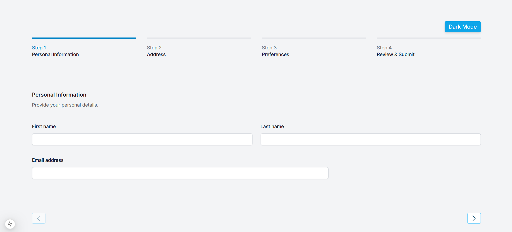
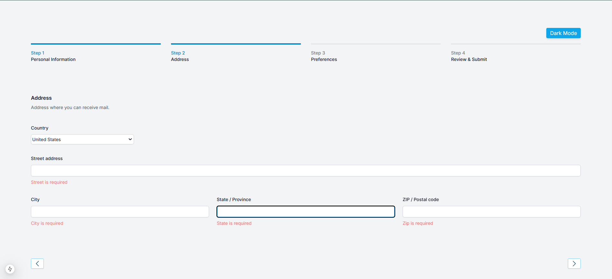
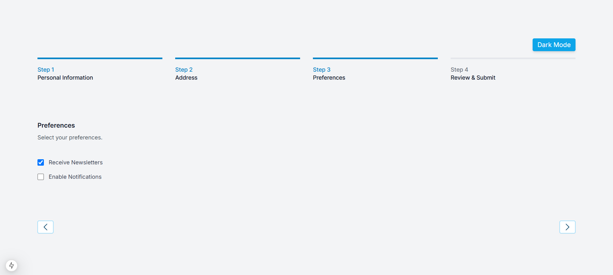
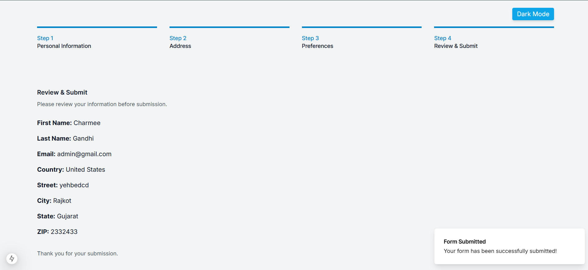

This is a [Next.js](https://nextjs.org) project bootstrapped with [`create-next-app`](https://nextjs.org/docs/app/api-reference/cli/create-next-app).

## Getting Started

First, run the development server:

```bash
npm run dev
# or
yarn dev
# or
pnpm dev
# or
bun dev
```

## Multi-Step User Form with NextJS and TypeScript

A **multi-step user form** built with **Next**, **TypeScript**, and **Tailwind CSS**, featuring smooth animations with **Framer Motion**. This form allows users to fill out their details step by step, review their inputs, and submit the data. 


## Table of Contents

- [Features](#features)
- [Technologies Used](#technologies-used)
- [Installation](#installation)
- [Usage](#usage)
- [Steps Overview](#steps-overview)
- [Customization](#customization)
- [License](#license)


## Features

- **Multi-step form with navigation buttons**
- **Form validation** using `react-hook-form` and `yup`
- **Smooth animations** powered by Framer Motion
- **Responsive design** using Tailwind CSS
- **Toast notification** genered by shadcn-ui
- Displays submitted data on a **review page**
- Dynamically **tracks the current step**
- Reset functionality after submission
- website visible in light and dark mode


## Technologies Used

- **React**: Component-based UI library
- **Next**: Component based framework of javascript
- **TypeScript**: Static typing for JavaScript
- **Tailwind CSS**: Utility-first CSS framework
- **Framer Motion**: Animations for step transitions
- **React Hook Form**: Form handling
- **Shadcn-ui** : For toast notifications
- **Yup**: Schema validation


## Installation

1. Clone the repository:
   ```bash
   git clone https://github.com/your-username/multi-step-user-form.git
   cd multi-step-user-form

2.  Install dependencies:
    ```bash
    npm install 

3. Start deployment server 
    ```bash
    npm run dev


## Usage

1. Fill in the fields step by step.
2. Change the website into dark and light mode accordingly.
3. Use the Next and Back buttons to navigate between steps.
4. On the final step, review your data.
5. Submit the form to see the entered data displayed. 


## Steps Overview

# Personal Information
- Fields: First Name, Last Name, Email
# Address Details
- Fields: Country, Street, City, State, ZIP
# Preferences
- check boxes
# Review and Submit
- Displays all user inputs for review and in last submit message.


## Customization
- Validation Rules: Update validationSchema.ts to customize field validation.
- Fields: Modify the Step components to add/remove fields.
- Styling: Update tailwind.css or component class names for custom styles.
- Animations: Tweak Framer Motion settings in App.tsx for transitions.

## License
This project is licensed under the MIT License. See the LICENSE file for details

## Screenshots





